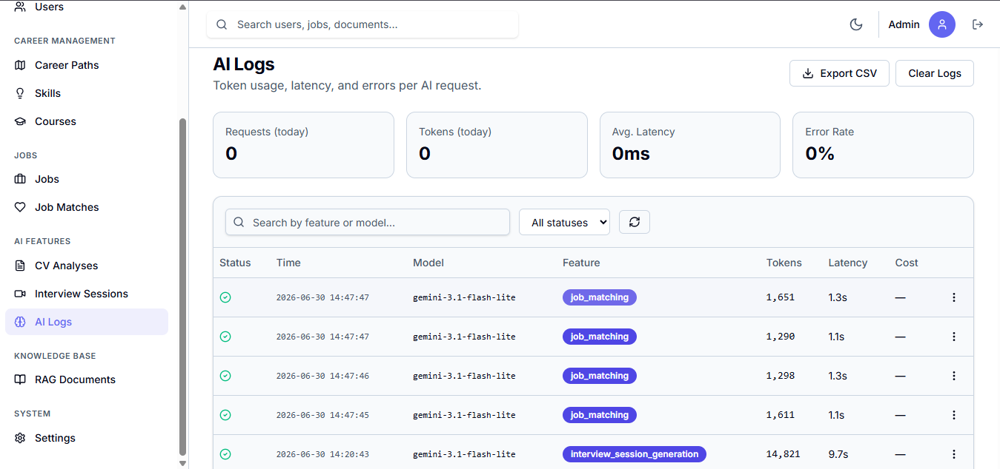
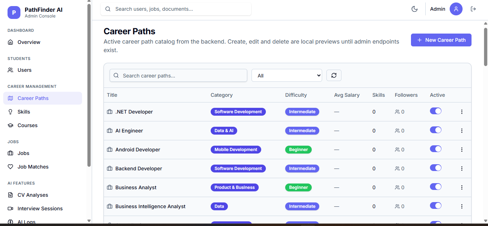
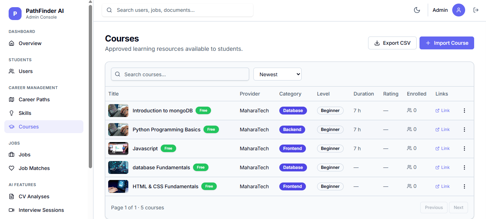
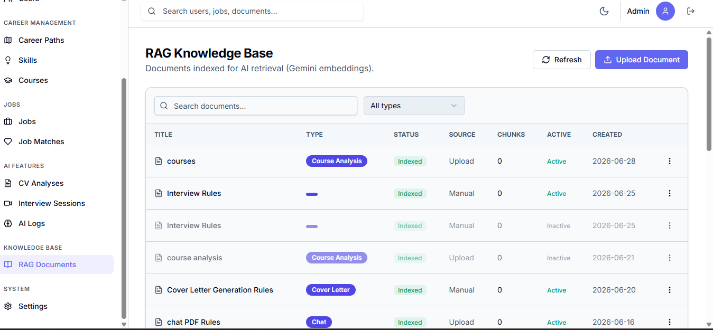

# 🚀 PathFinder AI Admin Dashboard

A modern and scalable **React + TypeScript** admin dashboard built for the **PathFinder AI Graduation Project**. The dashboard enables administrators to manage users, AI-powered services, workouts, nutrition plans, and platform analytics through a clean, responsive interface following **Feature-First Clean Architecture** principles.

> Built with maintainability, scalability, and developer experience in mind.

---
## 🎥 Live Demo

> 📺 **Project Walkthrough Video:**  
> https://drive.google.com/file/d/1gFEkoHO9f9PNpoJmuJy2oAzybiZVBdW-/view?usp=sharing
## ✨ Overview

PathFinder AI Admin Dashboard is the administrative portal of the PathFinder AI ecosystem. It communicates with the Node.js/Express backend through REST APIs and provides administrators with complete control over the platform.

The project follows a **Feature-First Clean Architecture**, making every feature independent, testable, and easy to extend.

---
## 📸 Screenshots

### AI Logs



### Career Path



### Courses



### Rag Document



## 🌟 Features

### 🔐 Authentication
- JWT Authentication
- Protected Routes
- Role-based Authorization
- Persistent Login

### 👥 User Management
- View registered users
- Search & Filter users
- User details
- Manage user accounts

### 🤖 AI Management
- Monitor AI interactions
- Manage Smart Coach data
- AI conversation history
- Usage analytics

### 💪 Workout Management
- Create workout categories
- Manage exercises
- Edit workout plans
- Organize muscle groups

### 🥗 Nutrition Management
- Manage meals
- Nutrition plans
- Calories & macros
- Food categories

### 📊 Dashboard Analytics
- Platform statistics
- User growth
- Activity monitoring
- Quick overview cards

### ⚙️ System Features
- Responsive Design
- Feature-Based Architecture
- API Integration
- Type-safe Development
- Environment Configuration
- Error Handling

---

## 🏗️ Project Architecture

The project follows **Feature-First Clean Architecture**.

```
src/
│
├── app/                # Application bootstrap, router & layouts
├── core/               # API client, authentication, environment
├── features/           # Business features
│   ├── data/
│   ├── domain/
│   ├── application/
│   └── presentation/
│
├── shared/             # Reusable components & utilities
├── styles/             # Global styles & design tokens
└── assets/             # Images, icons & static resources
```

Each feature is isolated into its own layer, making the codebase scalable and easy to maintain.

---

## 🛠️ Tech Stack

### Frontend

- React 19
- TypeScript
- Vite
- React Router
- Axios

### State Management

- Context API
- Custom Hooks

### Styling

- Tailwind CSS
- CSS Modules
- Responsive Design

### Architecture

- Feature-First Structure
- Clean Architecture
- Repository Pattern
- Dependency Separation

### Development Tools

- ESLint
- TypeScript
- Prettier
- npm

---

## 🚀 Getting Started

### Requirements

- Node.js 20+
- npm
- PathFinder Backend

### Installation

```bash
git clone <repository-url>

cd pathfinder-admin

npm install
```

Create your environment file.

```bash
cp .env.example .env
```

Default configuration

```env
VITE_API_BASE_URL=http://localhost:5000/api/v1
```

Run the development server

```bash
npm run dev
```

Open

```
http://localhost:5173
```

---

## 📜 Available Scripts

```bash
npm run dev          # Start development server

npm run build        # Production build

npm run typecheck    # TypeScript validation

npm run check        # Complete project verification
```

---

## 🔒 Security

- JWT Authentication
- Protected Admin Routes
- Secure API Communication
- Environment Variable Support
- No Sensitive Credentials Stored in Frontend

---

## 📌 Development Guidelines

- Never call APIs directly from pages.
- All API communication belongs inside the `data` layer.
- Keep business logic inside the `domain` layer.
- UI components remain presentation-only.
- Store only public configuration using `VITE_*`.
- Never expose backend secrets or service-role keys.

---

## 🔄 Backend Integration

The dashboard communicates with the backend through:

```
http://localhost:5000/api/v1
```

Current authentication is fully connected, while some management modules still use mock/demo data until their backend endpoints are completed.

---

## 📈 Future Improvements

- Real-time Dashboard
- Notifications System
- Advanced Charts
- Admin Roles & Permissions
- Audit Logs
- Export Reports
- Dark Mode
- Multi-language Support

---

## 📖 Documentation

Before making architectural changes, read:

- `AGENTS.md`
- `docs/FRONTEND_PROJECT_RULES.md`

---

## 👨‍💻 Team

**PathFinder AI Graduation Project**

Admin Dashboard built using **React + TypeScript** following modern software architecture principles.


